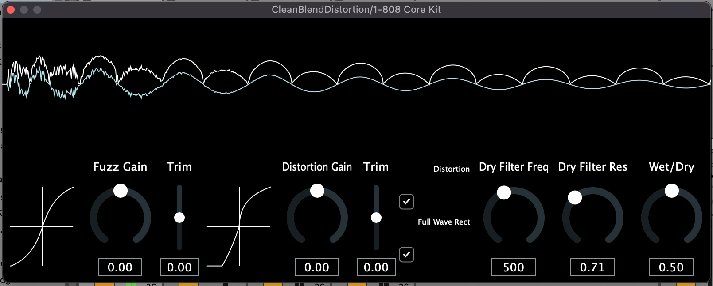

# CleanBlendDistortion

CleanBlendDistortion is a JUCE audio effect for fuzz and distortion with a full wave rectifier toggle.

These effects are made using information from [Designing Audio Effect Plugins in C++](https://www.google.co.uk/books/edition/Designing_Audio_Effect_Plugins_in_C++/qzr3DwAAQBAJ?hl=en&gbpv=0).

## Layout 

## Signal Chain
